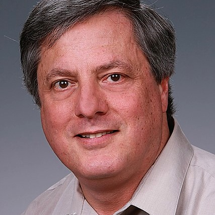
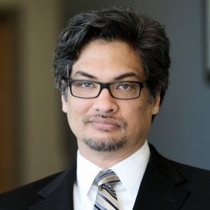

# Parallelizing Python: Transitioning Beyond One Core

In this workshop, we will cover general parallelization schemes and how they can be implemented in Python. The instructors, Dr. John Feo and Prof. Andrew Lumsdaine, are associated with the [Northwest Institute for Advanced Computing](https://www.niac-uw.org/) and the workshop is being hosted by the [Research Computing Club](http://students.washington.edu/hpcc/) at the University of Washington, Seattle.

## Schedule

**Day 1**

|Session| Time|
|--- | ---|
|Welcome/Intro (Coffee)|9:00 - 9:15|
|General Parallelization Essentials|9:15 - 10:30|
|Break	|10:30 - 10:45|
|General Parallelization Essentials - Lab|10:45 - 12:00|
|Lunch	|12:00 - 1:00|
|Accelerating Python with GPUs|1:00 - 2:30|
|Break	|2:30 - 2:45|
|Accelerating Python with GPUs - Lab|	2:45 - 4:00|

**Day 2**

|Session| Time|
|--- | ---|
|Multiprocessing in Python |9:15 - 10:30|
|Break |10:30 - 10:45|
|Multiprocessing in Python - Lab |10:45 - 12:00|
|Lunch |12:00 - 1:00|
|Parallelizing a Serial Code| 1:00 - 2:30|
|Break |2:30 - 2:45|
|Parallelizing a Serial Code - Lab |2:45 - 3:45|
|Closing Ceremonies |3:45 - 4:00|

## Materials
### Day 1
- Lab 1
    - General Parallelization Techniques
- Lab 2
    - Accelerating Python with GPUs

### Day 2
- Lab 3
    - Multiprocessing in Python
- Lab 4

## About the Instructors

### John Feo

    

    
Dr. John Feo is the director of the Northwest Institute for Advanced Computing, a joint research institute of the Pacific Northwest National Laboratory and University of Washington. He leads several large Department of Defense and Department of Energy research projects in discovering patterns of activities in social networks, cyber systems, critical infrastructures, and transportation.
      
The projects are developing scalable data analytic methods, and high-performance, multithreaded runtime systems for conventional and emerging computer systems. Dr. Feo received his Ph.D. in computer science from The University of Texas at Austin. He began his career at Lawrence Livermore National Laboratory where he managed the Computer Science Group and was the principal investigator of the Sisal Language Project.
  
Dr. Feo then joined Tera Computer Company (now Cray Inc) where he was a principal engineer and product manager for the MTA-1 and MTA-2, the first two generations of the Cray’s multithreaded architecture. He has taken short sabbaticals to work at Sun Microsystem, Microsoft, and Context Relevant.

### Andrew Lumsdaine

    

    
Dr. Andrew Lumsdaine is Chief Scientist at the Northwest Institute for Advanced Computing (NIAC), an Affiliate Professor in the Paul G. Allen School of Computer Science and Engineering, and also a Laboratory Fellow at Pacific Northwest National Laboratory. Dr. Lumsdaine is an internationally recognized expert in the area of high-performance computing (HPC) who has made important contributions in many of the constitutive areas of HPC. In particular, he has contributed in the areas of HPC systems, programming languages, software libraries, and performance modeling.
  
His work in HPC has been motivated by data-driven problems (large-scale graph analytics), as well as more traditional computational science problems. In addition, outside of the realm of HPC, he has done seminal work in the area of computational photography and plenoptic cameras. In his career, he has published more than 200 articles in top journals and conferences and holds 15 patents.
  
Dr. Lumsdaine also has contributed important software artifacts to the research community, especially in the area of Message Passing Interface (MPI). He also is active in a number of standardization efforts with important contributions to the MPI specification, the C++ programming language, and the Graph 500.

## Acknowledgements
- **[CEI](https://www.cei.washington.edu/)** and **[DIRECT](http://depts.washington.edu/uwdirect/)**
    - Jim Pfaendtner
    - Kelly Thornton
- **[eScience Institute](https://escience.washington.edu/)**
    - Robin Brooks
    - Madeleine Stevenson

## License
The content of this project itself is licensed under the [Creative Commons Attribution 3.0 Unported license](https://creativecommons.org/licenses/by/3.0/), and the code used in examples and labs is licensed under the [MIT license](https://github.com/UW-HPC/Parallelizing-Python-Workshop/blob/master/LICENSE).
